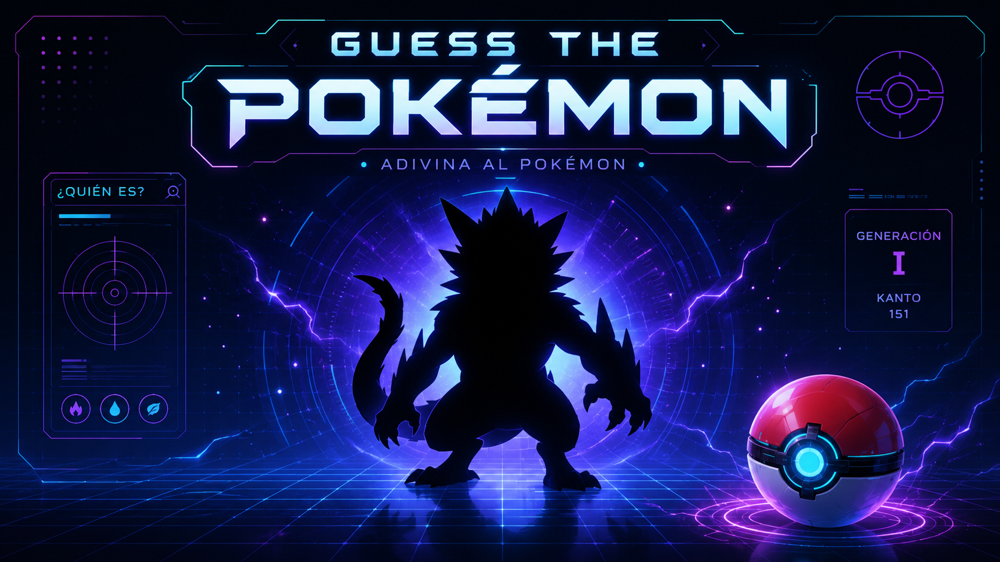
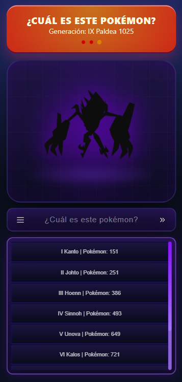
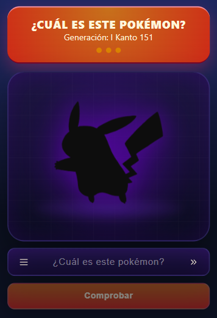
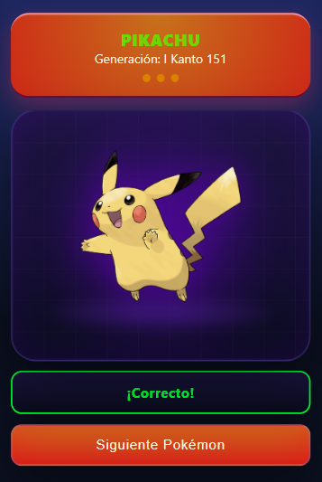
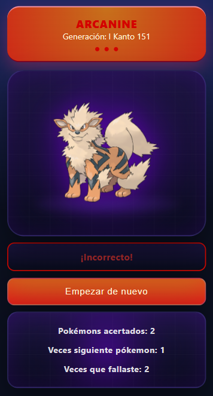

# Pokémon Guesser 🎮⚡



**Pokémon Guesser** es un juego web desarrollado con **React** y **TypeScript** en el que el jugador debe identificar el nombre del Pokémon mostrado en pantalla antes de quedarse sin vidas.

La aplicación obtiene los datos en tiempo real desde la **PokéAPI**, seleccionando un Pokémon aleatorio perteneciente a la generación elegida por el usuario.

---

## ✨ Características

- 🎲 Selección aleatoria de Pokémon.
- 👻 Imagen del Pokémon oculta mediante una silueta.
- ✍️ Introducción manual del nombre para comprobar la respuesta.
- ✅ Comprobación de respuestas correctas e incorrectas.
- ❤️ Sistema de tres vidas.
- ⏭️ Posibilidad de saltar un Pokémon consumiendo una vida.
- ☠️ Pantalla **Game Over** con estadísticas de la partida.
- 📚 Selección de generación Pokémon.
- 🌍 Consumo de datos desde PokéAPI.
- 📱 Diseño responsive para dispositivos móviles y escritorio.
- ⚡ Animaciones e interfaz inspiradas en una Pokédex futurista.

---

## 🛠️ Tecnologías utilizadas

- React 19
- TypeScript
- Vite
- CSS Modules
- PokéAPI
- GitHub Pages

---

## 🚀 Instalación

Clona el repositorio:

```bash
git clone https://github.com/AbrahamGalvezV/Poke_API.git
```

Accede al directorio del proyecto:

```bash
cd Poke_API
```

Instala las dependencias:

```bash
npm install
```

Inicia el servidor de desarrollo:

```bash
npm run dev
```

La aplicación estará disponible en:

```txt
http://localhost:5173
```

---

## 🎮 Cómo jugar

### 1. Selecciona una generación

Abre el menú hamburguesa y elige la generación con la que deseas jugar.



---

### 2. Observa la silueta

Se mostrará la silueta de un Pokémon elegido aleatoriamente.



---

### 3. Escribe el nombre del Pokémon

Introduce el nombre que creas correcto y pulsa **Comprobar**.

---

### 4. Comprueba el resultado

Si aciertas, el Pokémon se revelará y podrás continuar jugando.



Si fallas, perderás una vida y se mostrará el nombre correcto.


---

### 5. Saltar un Pokémon

Si no conoces el Pokémon, puedes pulsar **Siguiente Pokémon** para generar otro. Esta acción también consume una vida.

---

### 6. Game Over

Cuando se consuman las tres vidas aparecerá la pantalla **Game Over**, mostrando las estadísticas de la partida:

- 🟢 Pokémon acertados.
- ⏭️ Veces que se ha pulsado **Siguiente Pokémon**.
- ❌ Veces que se ha introducido un nombre incorrecto.



---

## 🌐 Jugar online

Puedes probar el juego directamente desde GitHub Pages:

**https://abrahamgalvezv.github.io/Poke_API/**

---

## 📖 Generaciones disponibles

| Generación | Región | Pokémon |
| ---------- | ------- | -------: |
| I | Kanto | 151 |
| II | Johto | 251 |
| III | Hoenn | 386 |
| IV | Sinnoh | 493 |
| V | Unova | 649 |
| VI | Kalos | 721 |
| VII | Alola | 809 |
| VIII | Galar | 905 |
| IX | Paldea | 1025 |

---

## 🔗 API utilizada

Este proyecto consume la API pública **PokéAPI**.

Página oficial:

https://pokeapi.co

Ejemplo de endpoint:

```txt
https://pokeapi.co/api/v2/pokemon/25
```

---

## 🎯 Objetivos del proyecto

Este proyecto ha servido para practicar y reforzar conocimientos sobre:

- Desarrollo de aplicaciones con React y TypeScript.
- Consumo de APIs REST.
- Gestión del estado mediante Custom Hooks.
- Creación de componentes reutilizables.
- Arquitectura modular de aplicaciones React.
- Diseño responsive mediante CSS Modules.
- Despliegue de aplicaciones con GitHub Pages.

---

## 💡 Curiosidades del proyecto

- Cada Pokémon se obtiene en tiempo real desde la PokéAPI.
- El jugador puede elegir cualquier generación disponible antes de comenzar la partida.
- La interfaz está inspirada en una Pokédex futurista con efectos de iluminación, cuadrículas y animaciones.
- La lógica principal del juego se encuentra encapsulada en el Custom Hook `useGameManager`, separando completamente la lógica de la interfaz.
- El proyecto está desarrollado íntegramente en **TypeScript**, aprovechando el tipado estático para reducir errores y mejorar el mantenimiento del código.

---

## 📄 Licencia

Este proyecto se distribuye bajo la licencia **MIT**, lo que permite utilizar, modificar y distribuir el código libremente siempre que se mantenga el aviso de copyright y la licencia original.

---

## 🚧 Próximas mejoras

Estas son algunas de las funcionalidades previstas para futuras versiones del proyecto:

- 🔐 **Sistema de autenticación**
  - Inicio de sesión mediante cuenta de usuario antes de comenzar a jugar.

- 🎯 **Niveles de dificultad personalizables**
  - Selección del número de vidas disponibles (3, 5 u 8).
  - Selección de la generación Pokémon con la que jugar (desde la I hasta la IX, con un total de 1025 Pokémon).

- 🏆 **Sistema de puntuaciones**
  - Almacenamiento de las mejores partidas en la memoria local del navegador (*Local Storage*).
  - Registro de:
    - Pokémon acertados.
    - Veces que se ha utilizado **Siguiente Pokémon**.
    - Respuestas incorrectas.
    - Nivel de dificultad seleccionado.
    - Generación elegida.
    - Fecha de la partida.

- 📊 **Historial de partidas**
  - Consulta de las últimas partidas jugadas.
  - Posibilidad de comparar resultados entre diferentes niveles y generaciones.

- 🎨 **Mejoras visuales**
  - Nuevas animaciones.
  - Efectos de transición más fluidos.
  - Más opciones de personalización de la interfaz.

- 📱 **Optimización para dispositivos móviles**
  - Ajuste fino de la interfaz para pantallas de menor altura.
  - Mejor experiencia táctil en iOS y Android.

- 🔊 **Efectos de sonido**
  - Sonidos al acertar, fallar o cambiar de Pokémon.
  - Música opcional durante la partida.

- 🌐 **Clasificación online (futuro)**
  - Ranking global de jugadores.
  - Comparación de puntuaciones con otros usuarios.